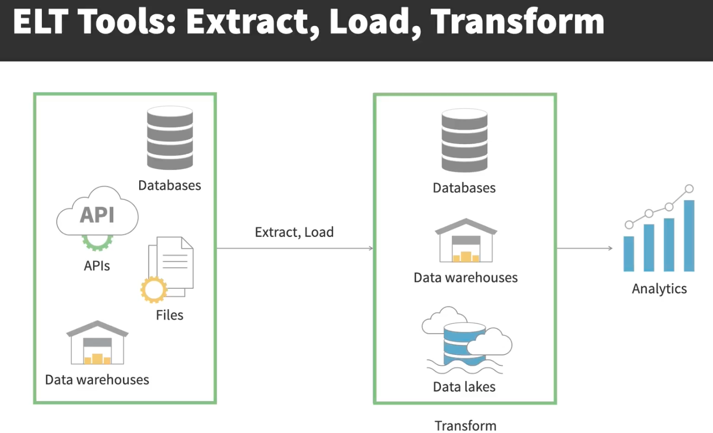
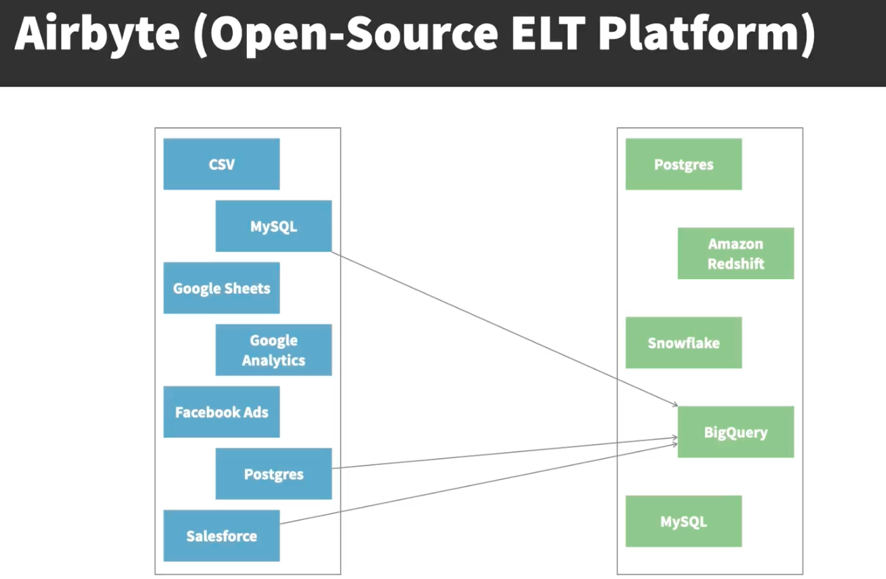

# **Tools**
- **Airbyte**: To extract data from Postgres database and load into BigQuery, the new data warehouse. 
- **dbt**: Transformation tool. To turn the raw, scattered data into neat tables that provides insights about customers. Also to test and document the data models. 
- **Dagster and Dagit**: To ensure everything runs smoothly and in the right sequence.
- **BigQuery**: Fully managed serverless data warehouse that enables fast SQL queries. Scalable. Cost-effective. Integrates with other tools. Generous Free Tier. Others include Snowflake and Redshift. On BigQuery, a JSON key is a secure file that an application can use to authenticate as the service account.
- **ELT Tools**: Extract, Load, and Transform. These tools help to extract data from a multitude of sources like databases or APIs and load it into a target system like a data warehouse or a data lake, for whatever transformation is then needed. They replace ad-hoc scripting, simplifying the extraction, loading, and optional transformation processes, thereby minimizing errors and maintenance efforts. 

- **Airbyte (Open Source ELT Platform)**: Allows you to extract data from various sources and load it into a wide range of destinations, simplifying the creation and maintenenace of data pipelines. Operates around connectors, which handle the extraction from a source and then loading into a destination. Uses docker containers which can be easily managed and scaled. Can be deployed on own infrastructure, like on on-premises servers or Cloud virtual machines. Also has Airbyte Cloud (fully managed)

