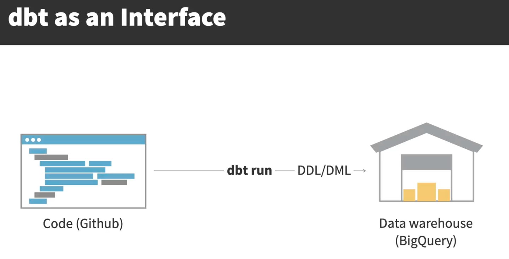

# **Tools**
- **Airbyte**: To extract data from Postgres database and load into BigQuery, the new data warehouse. 
- **dbt**: Data Build Tool. Transformation tool. Open Source. Based on Python. Integrates with modern data ecosystems. To turn the raw, scattered data into neat tables that provides insights about customers. Also to test and document the data models. Users transform data using SQL.
- **Jinja**: A lightweight templating language. dbt integrates with jinja. SQL files can contain Jinja. Allows control structures in queries such as if statements and for loops. Enables sharing of repeated SQL patterns through macros; enhancing reusability and efficiency.
- **Dagster and Dagit**: To ensure everything runs smoothly and in the right sequence.
- **BigQuery**: Fully managed serverless data warehouse that enables fast SQL queries. Scalable. Cost-effective. Integrates with other tools. Generous Free Tier. Others include Snowflake and Redshift. On BigQuery, a JSON key is a secure file that an application can use to authenticate as the service account.
- **ELT Tools**: Extract, Load, and Transform. These tools help to extract data from a multitude of sources like databases or APIs and load it into a target system like a data warehouse or a data lake, for whatever transformation is then needed. They replace ad-hoc scripting, simplifying the extraction, loading, and optional transformation processes, thereby minimizing errors and maintenance efforts. 

- **Airbyte (Open Source ELT Platform)**: Allows you to extract data from various sources and load it into a wide range of destinations, simplifying the creation and maintenenace of data pipelines. Operates around connectors, which handle the extraction from a source and then loading into a destination. Uses docker containers which can be easily managed and scaled. Can be deployed on own infrastructure, like on on-premises servers or Cloud virtual machines. Also has Airbyte Cloud (fully managed)

### **Main dbt Features**
1. **Models:** SQL queries that define the transformation logic and structure of your data. They serve as the blueprints for creating tables or views in your data warehouse. For every SQL file in your model directory, there is a corresponding table or view that's materialized in your warehouse. 
2. **Testing**
3. **Documentation** (of your data models - can be automated.)
4. **Version Control** 

DBT serves as the interface between the code, which is stored and managed in a Git repo, and the data.
#### **Using dbt**
- dbt CLI
- dbt Cloud: hosted version with IDE and interface to run dbt commands.

### **Benefits of a dbt Structure**
- Reduce redundancy
- Reduce complexity

### **dbt Project-Naming Conventions**
- **Sources**: raw data tables
- **Staging**: clean, standardized source data
- **Intermediate**: transformed data between staging and final
- **Marts**: final data used for analysis and visualization

### **Types of Marts Models**
- Fact: Capture events or transactions. Updated often and quickly. 
- Dimensions: Business entities that don't often change.  

### **Starting dbt**
- **dbt init**: creates a new folder with necessary files to get started with dbt. creates a connection profile on your local machine, called _profiles.yml_.
- **_source_ function**: provides abstraction with advantages like single configuration, better visibility (green nodes in the lineage graph), and data freshness.
- **dbt debug**: checks the connection settings and verifies if dbt can successfully connect to the data platform.